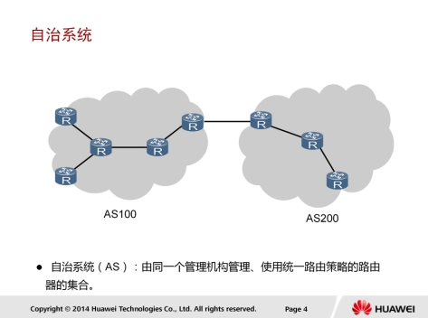
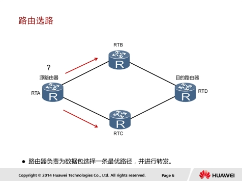
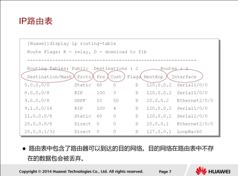
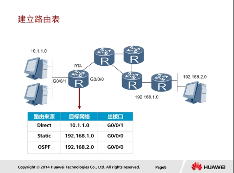
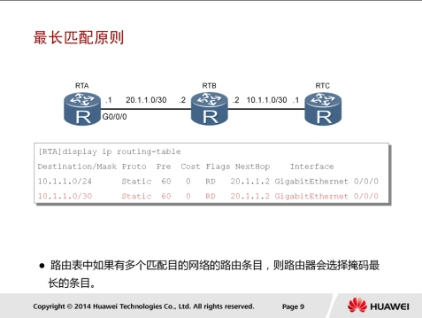
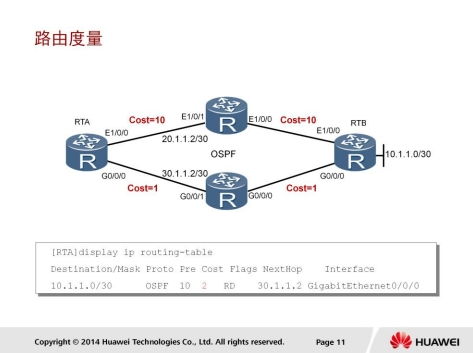
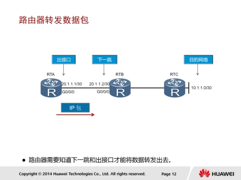

# IP路由基础

## 自治系统



一般地我们可以把一个企业网络认为是一个自治系统AS（Autonomous System）。根据RFC1030的定义，自治系统是由一个单一实体管辖的网络，这个实体可以是一个互联网服务提供商，或一个大型组织机构。自治系统内部遵循一个单一且明确的路由策略。最初，自治系统内部只考虑运行单个路由协议；然而，随着网络的发展，一个自治系统内现在也可以支持同时运行多种路由协议。

## LAN和广播域


一个AS通常由多个不同的局域网组成。以企业网络为例，各个部门可以属于不同的局域网，或者各个分支机构和总部也可以属于不同的局域网。

局域网内的主机可以通过交换机来实现相互通信。不同局域网之间的主机要想相互通信，可以通过路由器来实现。路由器工作在网络层，隔离了广播域，并可以作为每个局域网的网关，发现到达目的网络的最优路径，最终实现报文在不同网络间的转发。

此例中，RTA和RTB把整个网络分成了三个不同的局域网，每个局域网为一个广播域。LAN1内部的主机直接可以通过交换机实现相互通信，LAN2内部的主机之间也是如此。但是，LAN1内部的主机不LAN2内部的主机之间则必须要通过路由器才能实现相互通信。

## 路由选择



路由器收到数据包后，会根据数据包中的目的IP地址选择一条最优的路径，并将数据包转发到下一个路由器，路径上最后的路由器负责将数据包送交目的主机。

数据包在网络上的传输就好像是体育运动中的接力赛一样，每一个路由器负责将数据包按照最优的路径向下一跳路由器进行转发，通过多个路由器一站一站的接力，最终将数据包通过最优路径转发到目的地。当然有时候由于实施了一些特别的路由策略，数据包通过的路径可能并不一定是最佳的。

路由器能够决定数据报文的转发路径。如果有多条路径可以到达目的地，则路由器会通过进行计算来决定最佳下一跳。计算的原则会随实际使用的路由协议不同而不同。

## IP路由表



路由器转发数据包的关键是路由表。

每个路由器中都保存着一张路由表，表中每条路由项都指明了数据包要到达某网络或某主机应通过路由器
的哪个物理接口发送，以及可到达该路径的哪个下一个路由器，或者不再经过别的路由器而直接可以到达目的地。

路由表中包含了下列关键项：

* 目的地址（Destination）：用来标识IP包的目的地址或目的网络。
* 网络掩码（Mask）：IP地址和网络掩码进
  行“逻辑不”便可得到相应的网段信息。网络掩码的另一个作用还表现在当路由表中有多条目的地址相同的路由信
  息时，路由器将选择其掩码最长的一项作为匹配项。
* 输出接口（Interface）：指明IP包将从该路由器的哪个接口转发出去。
* 下一跳IP地址（NextHop）：指明IP包所经由的下一个路由器的接口地址。
* 路由表中优先级、度量值等其他的几个字段我们将在以后进行介绍。

## 建立路由表



根据来源的不同，路由表中的路由通常可分为以下三类：

1. 链路层协议发现的路由（也称为接口路由或直连路由）。
2. 由网络管理员手工配置的静态路由。
3. 动态路由协议发现的路由。

### 最长匹配原则



路由器在转发数据时，需要选择路由表中的最优路由。当数据报文到达路由器时，路由器首先提取出报文的目的IP地址，然后查找路由表，将报文的目的IP地址不路由表中某表项的掩码字段做“不”操作，“不”操作后的结果跟路由表该表项的目的IP地址比较，相同则匹配上，否则就没有匹配上。 当不所有的路由表项都进行匹配后，路由器会选择一个掩码最长的匹配项。

如图所示，路由表中有两个表项到达目的网段10.1.1.0，下一跳地址都是20.1.1.2。如果要将报文转发至网段10.1.1.1，则10.1.1.0/30符合最长匹配原则。

## 路由优先级


路由器可以通过多种不同协议学习到去往同一目的网络的路由，当这些路由都符合最长匹配原则时，必须决定哪个路由优先。

每个路由协议都有一个协议优先级（取值越小、优先级越高）。当有多个路由信息时，选择最高优先级的路由作为最佳路由。

如图所示，路由器通过两种路由协议学习到了网段10.1.1.0的路由。虽然RIP协议提供了一条看起来更加直连的路线，但是由于OSPF具有更高的优先级，因而成为优选路由，并被加入路由表中。

## 路由度量



如果路由器无法用优先级来判断最优路由，则使用度量值（metric）来决定需要加入路由表的路由。

一些常用的度量值有：跳数，带宽，时延，代价，负载，可靠性等。

* 跳数是指到达目的地所通过的路由器数目。
* 带宽是指链路的容量，高速链路开销（度量值）较小。
* metric值越小，路由越优先；因此，图示中metric=1+1=2的路由是到达
* 目的地的最优路由，其表项可以在路由表中找到。

## 路由器转发数据包



路由器收到一个数据包后，会检查其目的IP地址，然后查找路由表。查找到匹配的路由表项之后，路由器会根据该表项所指示的出接口信息和下一跳信息将数据包转发出去。

# 静态路由基础


静态路由是指由管理员手动配置和维护的路由。静态路由配置简单，并且无需像动态路由那样占用路由器的CPU资源来计算和分析路由更新。

静态路由的缺点在于，当网络拓扑发生变化时，静态路由不会自动适应拓扑改变，而是需要管理员手动进行调整。
静态路由一般适用于结构简单的网络。

在复杂网络环境中，一般会使用动态路由协议来生成动态路由。不过，即使是在复杂网络环境中，合理地配置一些静态路由也可以改进网络的性能。

## 静态路由配置


```
ip route-static ip-address { mask | mask-length } interface-type interface-number [ nexthop-address ]
ip route-static 192.168.1.0 255.255.255.0 10.0.12.1
```

该命令用来配置静态路由。

* ip address指定了一个网络或者主机的目的地址。
* mask指定了一个子网掩码或者前缀长度。
* 如果使用了广播接口如以太网接口作为出接口，则必须要指定下一跳地址。
* 如果使用了串口作为出接口，则可以通过参数interface-type和interface-number（如Serial 1/0/0）来配置出接口，此时不必指定下一跳地址。


# Reference Links：

http://bbs.hh010.com/
