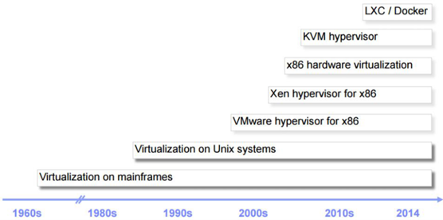
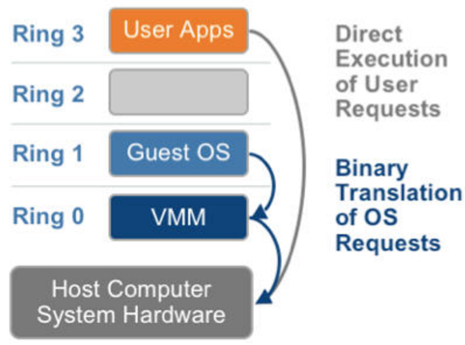
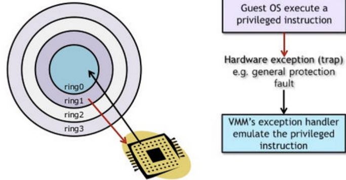
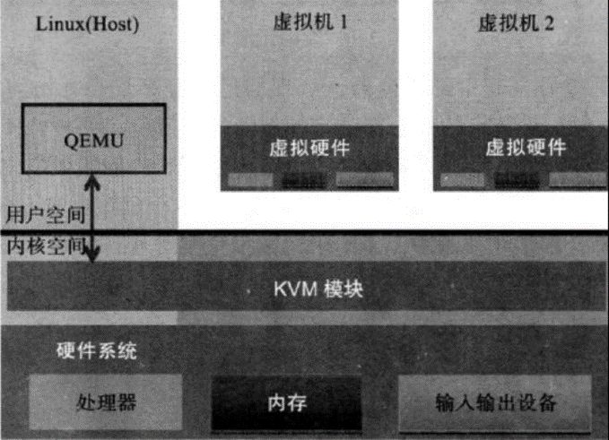
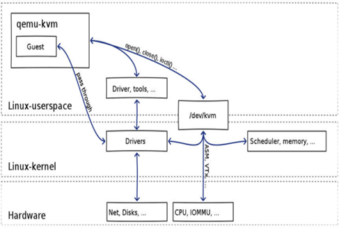
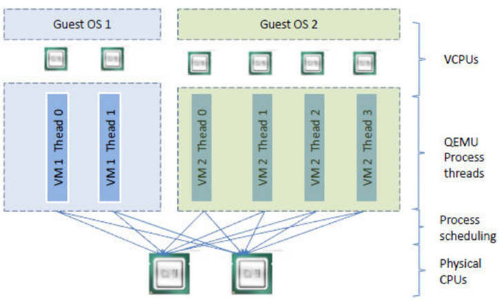
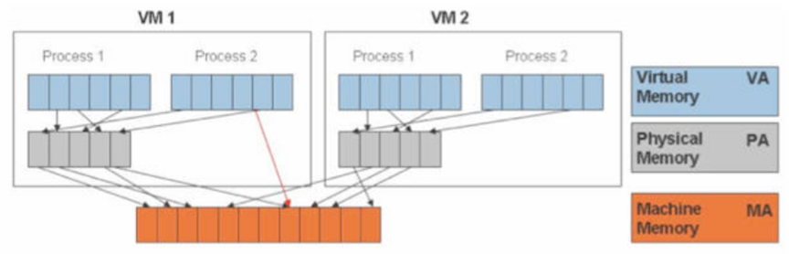
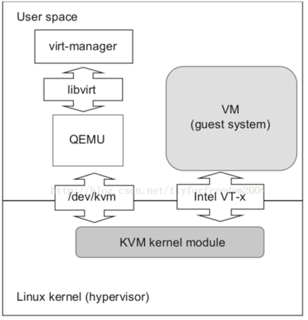

> kvm基础篇的几篇文章来之网上下载的资料，已找不到来源，如果知道来源可以与我联系

# 虚拟化简史

## 为什么需要CPU虚拟化

X86 操作系统是设计在直接运行在裸硬件设备上的，因此它们自动认为它们完全占有计算机硬件。x86 架构提供四个特权级别给操作系统和应用程序来访问硬件。 Ring 是指 CPU 的运行级别，Ring 0是最高级别，Ring1次之，Ring2更次之…… 就 Linux+x86 来说， 操作系统（内核）需要直接访问硬件和内存，因此它的代码需要运行在最高运行级别  Ring0上，这样它可以使用特权指令，控制中断、修改页表、访问设备等等。

应用程序的代码运行在最低运行级别上ring3上，不能做受控操作。如果要做，比如要访问磁盘，写文件，那就要通过执行系统调用（函数），执行系统调用的时候，CPU的运行级别会发生从ring3到ring0的切换，并跳转到系统调用对应的内核代码位置执行，这样内核就为你完成了设备访问，完成之后再从ring0返回ring3。这个过程也称作用户态和内核态的切换。

那么，虚拟化在这里就遇到了一个难题，因为宿主操作系统是工作在 ring0 的，客户操作系统就不能也在 ring0了，但是它不知道这一点，以前执行什么指令，现在还是执行什么指令，但是没有执行权限是会出错的。所以这时候虚拟机管理程序（VMM）需要避免这件事情发生。 虚机怎么通过VMM实现 Guest CPU 对硬件的访问，根据其原理不同有三种实现技术：

1. 全虚拟化
2. 半虚拟化
3. 硬件辅助的虚拟化

## 基于二进制翻译的全虚拟化（Full Virtualization with Binary Translation）

客户操作系统运行在 Ring 1，它在执行特权指令时，会触发异常（CPU的机制，没权限的指令会触发异常），然后 VMM 捕获这个异常，在异常里面做翻译，模拟，最后返回到客户操作系统内，客户操作系统认为自己的特权指令工作正常，继续运行。但是这个性能损耗，就非常的大，简单的一条指令，执行完了事，现在却要通过复杂的异常处理过程。

异常 “捕获（trap）-翻译（handle）-模拟（emulate）” 过程：

## 超虚拟化（或者半虚拟化/操作系统辅助虚拟化 Paravirtualization）

半虚拟化的思想就是，修改操作系统内核，替换掉不能虚拟化的指令，通过超级调用（hypercall）直接和底层的虚拟化层hypervisor来通讯，hypervisor 同时也提供了超级调用接口来满足其他关键内核操作，比如内存管理、中断和时间保持。

这种做法省去了全虚拟化中的捕获和模拟，大大提高了效率。所以像XEN这种半虚拟化技术，客户机操作系统都是有一个专门的定制内核版本，和x86、mips、arm这些内核版本等价。这样以来，就不会有捕获异常、翻译、模拟的过程了，性能损耗非常低。这就是XEN这种半虚拟化架构的优势。这也是为什么XEN只支持虚拟化Linux，无法虚拟化windows原因，微软不能改代码。

## 硬件辅助的全虚拟化

2005年后，CPU厂商Intel 和 AMD 开始支持虚拟化了。 Intel 引入了 Intel-VT （Virtualization Technology）技术。 这种 CPU有 VMX root operation 和 VMX non-root operation两种模式，两种模式都支持Ring 0 ~ Ring 3 共 4个运行级别。这样，VMM 可以运行在 VMX root operation模式下，客户OS运行在VMX non-root operation模式下。

而且两种操作模式可以互相转换。运行在 VMX root operation 模式下的 VMM 通过显式调用 VMLAUNCH 或 VMRESUME 指令切换到VMX non-root operation模式，硬件自动加载 Guest OS 的上下文，于是Guest OS获得运行，这种转换称为VM entry。Guest OS 运行过程中遇到需要 VMM 处理的事件，例如外部中断或缺页异常，或者主动调用 VMCALL 指令调用 VMM 的服务的时候（与系统调用类似），硬件自动挂起 Guest OS，切换到 VMX root operation 模式，恢复 VMM 的运行，这种转换称为VM exit。VMX root operation 模式下软件的行为与在没有 VT-x 技术的处理器上的行为基本一致；而VMX non-root operation 模式则有很大不同，最主要的区别是此时运行某些指令或遇到某些事件时，发生VM exit。也就说，硬件这层就做了些区分，这样全虚拟化下，那些靠“捕获异常-翻译-模拟”的实现就不需要了。而且CPU厂商，支持虚拟化的力度越来越大，靠硬件辅助的全虚拟化技术的性能逐渐逼近半虚拟化，再加上全虚拟化不需要修改客户操作系统这一优势，全虚拟化技术应该是未来的发展趋势。

## 几种虚拟化技术对比

| 利用二进制翻译的全虚拟化 | 硬件辅助虚拟化                     | 操作系统协助/半虚拟化                                                                       |
| ------------------------ | ---------------------------------- | ------------------------------------------------------------------------------------------- |
| 实现技术                 | BT和直接执行                       | 遇到特权指令转到root模式执行                                                                |
| 客户操作系统修改/兼容性  | 无需修改客户操作系统，最佳兼容性   | 无需修改客户操作系统，最佳兼容性                                                            |
| 性能                     | 差                                 | 全虚拟化下，CPU需要在两种模式之间切换，带来性能开销； 但是，其性能在逐渐逼近半虚拟化。 |
| 应用厂商                 | VMware Workstation/QEMU/Virtual PC | VMware ESXi/微软Hyper-V/Xen 3.0/KVM                                                         |

# KVM简介

KVM 全称是基于内核的虚拟机（Kernel-based Virtual Machine），它是一个 Linux的一个内核模块，该内核模块使得 Linux变成了一个Hypervisor：它由 Quramnet开发，该公司于 2008年被 Red Hat 收购。

它支持 x86 (32 and 64 位), s390, Powerpc 等 CPU。它从 Linux 2.6.20 起就作为一模块被包含在 Linux 内核中。它需要支持虚拟化扩展的CPU。它是完全开源的。官方网站：[http://www.linux-kvm.org/page/Main_Page](http://www.linux-kvm.org/page/Main_Page)

# KVM 架构

KVM 是基于虚拟化扩展（Intel VT 或者 AMD-V）的 X86 硬件的开源的 Linux 原生的全虚拟化解决方案。KVM 中，虚拟机被实现为常规的 Linux 进程，由标准 Linux 调度程序进行调度；虚机的每个虚拟 CPU 被实现为一个常规的 Linux 进程。这使得 KVM 能够使用 Linux 内核的已有功能。但是，KVM 本身不执行任何硬件模拟，需要客户空间程序通过 内核模块/dev/kvm 接口设置一个客户机虚拟服务器的地址空间，向它提供模拟的 I/O，并将它的视频显示映射回宿主的显示屏。目前这个应用程序是 QEMU。

## Linux 上的用户空间、内核空间和虚机：

**Guest：**

* 客户机系统，包括CPU（vCPU）、内存、驱动（Console、网卡、I/O 设备驱动等），被 KVM 置于一种受限制的 CPU 模式下运行。

**KVM：**

* 运行在内核空间，提供CPU 和内存的虚级化，以及客户机的 I/O 拦截。Guest 的 I/O 被 KVM 拦截后，交给 QEMU 处理。

**QEMU：**

* 修改过的为KVM虚机使用的QEMU代码，运行在用户空间，提供硬件I/O虚拟化，通过IOCTL /dev/kvm 设备和 KVM 交互。

## KVM 实现拦截虚机的 I/O 请求的原理

现代CPU本身实现了对特殊指令的截获和重定向的硬件支持，甚至新的硬件会提供额外的资源来帮助软件实现对关键硬件资源的虚拟化从而提高性能。以 X86 平台为例，支持虚拟化技术的 CPU  带有特别优化过的指令集来控制虚拟化过程。通过这些指令集，VMM 很容易将客户机置于一种受限制的模式下运行，一旦客户机视图访问物理资源，硬件会暂停客户机的运行，将控制权交回给 VMM 处理。VMM 还可以利用硬件的虚级化增强机制，将客户机在受限模式下对一些特定资源的访问，完全由硬件重定向到 VMM 指定的虚拟资源，整个过程不需要暂停客户机的运行和 VMM 的参与。由于虚拟化硬件提供全新的架构，支持操作系统直接在上面运行，无需进行二进制转换，减少了相关的性能开销，极大简化了VMM的设计，使得VMM性能更加强大。从 2005 年开始，Intel 在其处理器产品线中推广 Intel Virtualization Technology 即 IntelVT 技术。

## QEMU-KVM

其实QEMU原本不是KVM的一部分，它自己就是一个纯软件实现的虚拟化系统，所以其性能低下。但是，QEMU代码中包含整套的虚拟机实现，包括处理器虚拟化，内存虚拟化，以及 KVM需要使用到的虚拟设备模拟（网卡、显卡、存储控制器和硬盘等）。为了简化代码，KVM 在 QEMU 的基础上做了修改。VM 运行期间，QEMU 会通过 KVM 模块提供的系统调用进入内核，由 KVM 负责将虚拟机置于处理的特殊模式运行。遇到虚机进行 I/O 操作，KVM 会从上次的系统调用出口处返回 QEMU，由QEMU来负责解析和模拟这些设备。从QEMU的角度看，也可以说是QEMU使用了KVM模块的虚拟化功能，为自己的虚机提供了硬件虚拟化加速。除此以外，虚机的配置和创建、虚机运行所依赖的虚拟设备、虚机运行时的用户环境和交互，以及一些虚机的特定技术比如动态迁移，都是QEMU自己实现的。

## KVM

KVM内核模块在运行时按需加载进入内核空间运行。KVM本身不执行任何设备模拟，需要QEMU通过 /dev/kvm 接口设置一个GUEST OS的地址空间，向它提供模拟的 I/O设备，并将它的视频显示映射回宿主机的显示屏。它是KVM虚机的核心部分，其主要功能是初始化CPU硬件，打开虚拟化模式，然后将虚拟客户机运行在虚拟机模式下，并对虚机的运行提供一定的支持。

以在Intel上运行为例，KVM模块被加载的时候，它：

首先初始化内部的数据结构；

做好准备后，KVM 模块检测当前的 CPU，然后打开CPU控制及存取CR4的虚拟化模式开关，并通过执行VMXON指令将宿主操作系统置于虚拟化模式的根模式；

最后，KVM模块创建特殊设备文件/dev/kvm并等待来自用户空间的指令。

接下来的虚机的创建和运行将是QEMU和KVM相互配合的过程。两者的通信接口主要是一系列针对特殊设备文件/dev/kvm的IOCTL调用。其中最重要的是创建虚机。它可以理解成KVM 为了某个特定的虚机创建对应的内核数据结构，同时，KVM 返回一个文件句柄来代表所创建的虚机。

 针对该句柄的调用可以对虚机做相应地管理，比如创建用户空间虚拟地址和客户机物理地址、真实物理地址之间的映射关系，再比如创建多个vCPU。KVM为每一个vCPU生成对应的文件句柄，对其相应地IOCTL 调用，就可以对vCPU进行管理。其中最重要的就是“执行虚拟处理器”。通过它，虚机在KVM的支持下，被置于虚拟化模式的非根模式下，开始执行二进制指令。在非根模式下，所有敏感的二进制指令都被CPU捕捉到，CPU在保存现场之后自动切换到根模式，由KVM决定如何处理。

 除了CPU的虚拟化，内存虚拟化也由KVM实现。实际上，内存虚拟化往往是一个虚机实现中最复杂的部分。CPU 中的内存管理单元MMU是通过页表的形式将程序运行的虚拟地址转换成实际物理地址。在虚拟机模式下，MMU的页表则必须在一次查询的时候完成两次地址转换。因为除了将客户机程序的虚拟地址转换了客户机的物理地址外，还要将客户机物理地址转化成真实物理地址。

## KVM 虚机的创建过程

1. qemu-kvm 通过对/dev/kvm的一系列 IOCTL 命令控制虚机。
2. 一个 KVM 虚机即一个 Linux qemu-kvm进程，与其他Linux进程一样被Linux 进程调度器调度。
3. KVM虚机包括虚拟内存、虚拟CPU和虚机 I/O设备，其中，内存和 CPU 的虚拟化由 KVM 内核模块负责实现，I/O 设备的虚拟化由QEMU负责实现。
4. KVM客户机系统的内存是qumu-kvm 进程的地址空间的一部分。
5. KVM虚机的vCPU 作为线程运行在 qemu-kvm进程的上下文中。

### vCPU、QEMU 进程、Linux 进程调度和物理CPU之间的逻辑关系：

因为CPU中的虚拟化功能的支持，并不存在虚拟的 CPU，KVM Guest代码是运行在物理 CPU 之上。

KVM实现客户机内存的方式是，利用mmap系统调用，在QEMU主线程的虚拟地址空间中申明一段连续的大小的空间用于客户机物理内存映射。

在有两个虚机的情况下，情形是这样的：

可见，KVM为了在一台机器上运行多个虚拟机，需要增加一个新的内存虚拟化层，也就是说，必须虚拟 MMU（Memory Management Unit） 来支持客户操作系统，来实现 VA -> PA -> MA 的翻译。客户操作系统继续控制虚拟地址到客户内存物理地址的映射 （VA -> PA），但是客户操作系统不能直接访问实际机器内存，因此VMM 需要负责映射客户物理内存到实际机器内存 （PA -> MA）。

### VMM 内存虚拟化的实现方式：

* 软件方式：通过软件实现内存地址的翻译，比如 Shadow page table （影子页表）技术
* 硬件实现：基于CPU的辅助虚拟化功能，比如AMD的NPT和Intel的EPT技术

KVM 中，虚机的物理内存即为qemu-kvm进程所占用的内存空间。KVM使用CPU辅助的内存虚拟化方式。在Intel和AMD平台，其内存虚拟化的实现方式分别为：

* AMD 平台上的 NPT （Nested Page Tables） 技术
* Intel 平台上的 EPT （Extended Page Tables）技术

## KVM的整体结构：

从GUI到Linux内核，包括以下五个组件：

1. **virt-manager**
   * 一个用来管理VM的GUI/CUI用户接口;它使用libvirt api 调用VM的各种功能。
2. **libvirt**
   * 一个工具及接口，作为较通用的服务器虚拟化软件，它支持Xen，VMware ESXi/GSX，当然，还有QEMU/KVM。

3) **QEMU**

   * 一个和KVM内核模块交互的模拟器，处理多种客户机系统请求如I/O;一个QEMU进程对应一个客户机系统。
4) **KVM内核模块**

   * 从狭义上来说，KVM是一个Linux内核模块，处理客户机系统的VM Exits和执行VM Entry指令。
5) **Linux内核**

   * 既然QEMU作为一个普通的用户进程运行，相应客户机系统的调度就由Linux内核自己来处理。

所有的组件都是开放源码软件(OSS)。

### KVM 的功能列表

KVM 所支持的功能包括：

* 支持CPU 和 memory 超分（Overcommit）
* 支持半虚拟化I/O （virtio）
* 支持热插拔（cpu，块设备、网络设备等）
* 支持对称多处理（Symmetric Multi-Processing，缩写为 SMP ）
* 支持实时迁移（Live Migration）
* 支持 PCI 设备直接分配和单根I/O虚拟化（SR-IOV）
* 支持内核同页合并（KSM ）
* 支持NUMA （Non-Uniform Memory Access，非一致存储访问结构 ）

## KVM 工具集合

**libvirt：**

* 操作和管理KVM虚机的虚拟化API，使用 C 语言编写，可以由 Python,Ruby, Perl, PHP, Java 等语言调用。可以操作包括 KVM，vmware，XEN，Hyper-v, LXC 等 Hypervisor。

**Virsh：**

* 基于libvirt 的命令行工具（CLI）

Virt-Manager：

* 基于libvirt的GUI工具

**virt-v2v：**

* 虚机格式迁移工具

**virt-* 工具：**

* 包括Virt-install （创建KVM虚机的命令行工具），Virt-viewer （连接到虚机屏幕的工具），Virt-clone（虚机克隆工具），virt-top 等

**sVirt：**

安全工具和selinux相关
