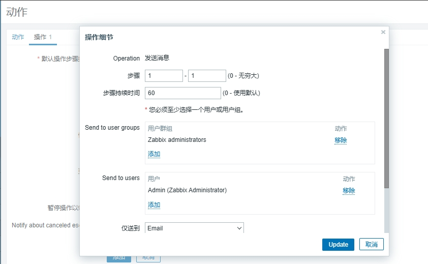
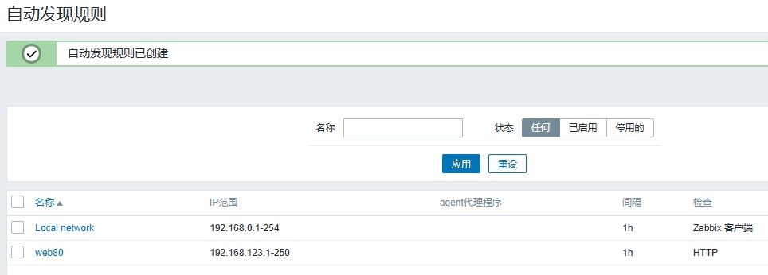

# 简介

## 监控的目的

* 报告系统运行状况
  * 每一部分必须同时监控内容包括吞吐量、反应事件、使用率
* 提前发现问题
  * 进行服务器性能调整前，知道调整什么
  * 找出系统的瓶颈在什么地方

## 监控的资源类别

* 公开数据
  * Web、FTP、SSH、数据库等应用服务
  * TCP或UDP端口
* 私有数据
  * CPU、内存、磁盘、网卡流量等使用信息
  * 用户、进程等运行信息

## 手动系统监控命令

* ps
* uptim
* iostat
* ss
* 其他

## 自动化监控系统

* Cacti
  * 基于SNMP协议的监控软件，强大的绘图能力
* Nagios
  * 基于Agent监控，强大的监控状态检查与报警机制
  * 插件极多，自己写监控脚本嵌入到Nagios非常方便
* Zabbix
  * 基于多种监控机制，支持分布式监控

## Zabbix简介

zabbix是一个企业级的高度集成的开源监控软件，提供了分布式监控解决方案，可以用来监控设备、服务等的可用性和性能。

zabbix的通用架构采用客户端/服务器端模式，分布式架构采用客户端/代理端/服务器端模式，Zabbix-Server将采集到的数据持久地存储到数据库中，用前端UI友好地展示给用户。

* 高度集成的监控解决方案
* 可以实现企业级的开源分布式监控
* 通过C/S模式采集监控数据
* 通过B/S模式实现Web管理

## 监控拓扑

* 监控服务器
  * 监控服务器可以通过SNMP或Agent采集数据
  * 数据可以写入MySQL、Oracle等数据库中
  * 服务器使用LNMP实现web前端管理
* 被监控主机
  * 被监控主机需要安装Agent
  * 常见的网络设备一般支持SNMP

# Zabbix安装

## 环境说明：

* 监控服务器

  * 设置主机名：zabbix server
  * 设置IP地址：192.168.123.200
  * 关闭防火墙、selinux
  * 系统：rockylinux9.2
* 监控客户端

  * 主机web1：192.168.123.210
  * 主机web1：192.168.123.211
  * 关闭防火墙、selinux
  * 系统：rockylinux9.2
* 软件配置

  * nginx版本：1.20

> zabbix-server内存尽量大些，4G为好

### 环境初始化

zabbix官网：https://www.zabbix.com/

#### 关闭selinux

```
sudo sed -i 's/SELINUX=enforcing/SELINUX=disabled/g' /etc/selinux/config
sudo setenforce 0

sudo reboot
```

#### 关闭防火墙

```
sudo systemctl disable firewalld && systemctl stop firewalld
sudo systemctl status firewalld
```

## 安装Zabbix服务端

获取zabbix下载源并安装

```
sudo vim  /etc/yum.repos.d/epel.repo
#在epel块添加以下内容
[epel]
...
excludepkgs=zabbix*
```

```
sudo rpm -Uvh https://repo.zabbix.com/zabbix/6.0/rhel/9/x86_64/zabbix-release-6.0-4.el9.noarch.rpm
sudo dnf clean all
```

安装Zabbix server，Web前端，agent

```
sudo dnf -y install zabbix-server-mysql zabbix-web-mysql zabbix-nginx-conf zabbix-sql-scripts zabbix-selinux-policy zabbix-agent
```

## 安装mariadb数据库

```
sudo dnf install -y mariadb-server
```

修改配置数据库配置

```
sudo vim /etc/my.cnf.d/mariadb-server.cnf
#添加以下内容
[mysqld]
skip_name_resolve = ON		#跳过主机名解析
innodb_file_per_table = ON	#开启独立表空间
innodb_buffer_pool_size = 256M	#缓存池大小
max_connections = 2000		#最大连接数
log-bin = master-log		#开启二进制日志
```

重启数据库服务

```
sudo systemctl restart mariadb

mysql_secure_installation
#root密码：LLYntU8moM3Rvrb

#设置数据库自启
sudo systemctl enable mariadb
```

创建zabbix数据库并授权账号

```
create database zabbix character set utf8mb4 collate utf8mb4_bin;
create user zabbix@localhost identified by 'HjdqTo5aChKp581';
grant all privileges on zabbix.* to zabbix@localhost;
set global log_bin_trust_function_creators = 1;
quit;
```

导入zabbix导入初始架构和数据，系统将提示您输入新创建的密码。

```
zcat /usr/share/zabbix-sql-scripts/mysql/server.sql.gz | mysql --default-character-set=utf8mb4 -uzabbix -p zabbix
```

Disable log_bin_trust_function_creators option after importing database schema.

```
#进入数据库
mysql -uroot -p
#禁用权限
set global log_bin_trust_function_creators = 0;
quit;
```

## 配置Zabbix Server端

```
sudo vim /etc/zabbix/zabbix_server.conf
ListenPort=10051		#默认监听端口
SourceIP=192.168.123.200	#发送采样数据请求的IP

#数据库配置
DBName=zabbix
DBUser=zabbix
DBPassword=HjdqTo5aChKp581
```

> 安装完成后，如果报错：Get value from agent failed: bind() failed: [99] Address not available
>
> 则注释掉server端的SourceIP=192.168.123.200 这个参数

## 为zabbix前端配置PHP

```
sudo vim /etc/nginx/conf.d/zabbix.conf
#取消注释以下内容
listen          8080;
server_name     example.com;
```

## 启动Zabbix server和agent进程

```
sudo systemctl restart zabbix-server zabbix-agent nginx php-fpm
#设置服务自启
sudo systemctl enable zabbix-server zabbix-agent nginx php-fpm
sudo systemctl status zabbix-server zabbix-agent nginx php-fpm
```

## 在Zabbix web 界面配置

访问以下地址

```
http://192.168.123.200:8080/setup.php
```

### 检查依赖，确保全部是OK

非OK的选项需要更改配置满足，不然可能无法进行安装


### 配置数据库连接

* Database port：数据库端口，3306，或0(0表示默认端口)
* Database name：数据库名称，zabbix
* User：zabbix
* Password：HjdqTo5aChKp581


下一步


预安装信息确认无误后，下一步


### 登录zabbix

默认账号密码是：Admin  zabbix


### 修改管理员密码

User settings > User profile > change password

新密码：7c_rU[beoy9&jZ]


### 修改页面语言为中文

```
sudo locale -a				#查看安装的语言包，没有中文
dnf install glibc-langpack-zh 		#安装中文语言包
sudo yum install langpacks-zh_CN	#设置默认语言
```

> 中文语言设置完重启zabbix服务就行，不需要重启服务器

### 其他注意点

停止zabbix服务命令

```
killall -9 zabbix-server
```

## 安装zabbix客户端

操作步骤和安装server端差不多，客户端监控只需要有agent就行

获取zabbix agent下载源并安装

```
sudo vim  /etc/yum.repos.d/epel.repo
#在epel块添加以下内容
[epel]
excludepkgs=zabbix*
```

```
sudo rpm -Uvh https://repo.zabbix.com/zabbix/6.0/rhel/9/x86_64/zabbix-release-6.0-4.el9.noarch.rpm
sudo dnf clean all
```

安装zabbix agent

```
sudo dnf -y install zabbix-agent
```

配置zabbix agent端

```
sudo vim /etc/zabbix/zabbix_agentd.conf
#需要修改以下参数
Server=127.0.0.1,192.168.123.200	#指明监控服务器IP
ListenPort=10050			#本机监听的端口
ListenIP=0.0.0.0			#本机监听的IP，
ServerActive=192.168.123.200:10051	#主动监控时的服务器,端口可以不写
Hostname=ca-s2102.novalocal		#本机能被server端识别的名称
```

启动服务

```
sudo systemctl start zabbix-agent && sudo systemctl enable zabbix-agent
#设置自启
sudo systemctl status zabbix-agent

#查看端口是否开启
sudo ss -lntup | grep zabbix
```

# 监控主机

## 添加监控主机

Host（主机）是监控的基本载体

Zabbix所有监控都是基于Host

**主要步骤：**

* 添加监控主机
* 应用监控模板
* 查看监控信息

### 添加监控主机

通过 Configuration > Hosts > Create Host 创建

根据提示输入：

* Host name：主机名
* Visible name：显示的名称
* Templates：应用的模板
* Group：所属组
* Interfaces
  * IP address：被监控主机IP
  * DNS name：可以不填
  * Connect to：选IP
  * Port：10050
* 其他默认


创建完成后，会立即显示添加的主机，状态显示：Enabled


### 应用监控模板

* 为主机添加关联的监控模板
* 在“Configuration > Templates”模板选项卡页面中
* 找到Links new templates, select选择合适的模板添加
* 这里我们选择 Linux by Zabbix agent 模板


### 查看监控信息

* 点击“Monitoring > Latest data”
* 在过滤器中填写条件，根据群组和主机搜索即可


* 勾选需要的数据，点击后面的Graph


* 然后会显示相关数据图


## 自定义监控

zabbix自带监控参数不能满足需求时，可以在客户端编写监控脚本给监控服务器使用。

* 配置客户端
  * 启用自定义监控项
  * 编写监控脚本
  * 重启agent
  * 测试编写的监控脚本
* 配置服务端

### 启用自定义监控项

更改客户端配置文件中的以下参数

```
sudo vim /etc/zabbix/zabbix_agentd.conf
Include=/etc/zabbix/zabbix_agentd.d/*.conf	#自定义配置文件存放路径，默认启用了
UnsafeUserParameters=1				#开启自定义监控
```

> 有些版本的zabbix配置文件的自定义监控脚本路径也可能是：Include=/usr/local/etc/zabbix_agentd.conf.d/*.conf

> 自定义监控配置文件编写规则在zabbix_agentd.conf中有写

#### 自定义监控项格式

Format: UserParameter=`<key>`,`<shell command>`

* UserParameter：定义监控项的关键字
* key：该监控项名称
* shell command：要执行的自定义脚本，可以是shell脚本，也可是shell命令

一行就是一个监控命令，多个监控命令需要写多行

### 编写监控脚本

示例：创建自定义key

```
sudo vim /etc/zabbix/zabbix_agentd.d/get_user_num.conf
#添加以下内容
#统计主机有多少个用户
UserParameter=get_user_num,wc -l /etc/passwd | awk '{print $1}'
```

### 重启agent服务

```
sudo systemctl restart zabbix-agent
sudo systemctl status zabbix-agent
```

### 测试自定义key是否生效

```
zabbix_get -s 127.0.0.1 -k get_user_num
#结果显示有25个用户
25
```

## 配置服务端

* 创建自定义监控模板
* 设置监控命令对应的监控项
* 应用创建的模板监控主机
* 查看监控数据

> 在 Zabbix 6.0 版本中，删除了"应用集"（Application Sets）这个功能。

### 创建自定义监控模板

在“Configuration > Templates”点击右上角“创建模板”


设置模板名称和组名称

* Template name
* Visible name
* New group


### 设置监控命令对应的监控项

在"Configuration > Templates > Items > Create item"，创建监控项


设置项目参数

* 项目名称
* 类型：一般选zabbix客户端
* 键值：如果监控项使用的zabbix内置的命令的化，可以选择zabbix内置命令。这里填自定义命名的key：get_user_num，自定义key，必须与配置文件一致。
* 信息类型：自定义监控命令返回的结果类型


### 应用创建的模板监控主机

与监控项目类似，为监控数据创建图形

* 设置图形参数
  * 填写名称
  * 图形类别（以此为线条，填充图，饼图，分割饼图）
  * 添加监控项目

"Configuration > Hosts > 选择主机" 点击“选择”，添加上文设置的自定义模板链接即可


### 查看监控数据

两种方法查看：

在“监测 > 最新数据 > 选择对应主机”能看到所有的监控项，其中有我们设置的自定义监控项


"监测 > 主机" 选择对应的主机，然后查看自动生成的图表


# 监控报警

## 报警机制

当监控的参数超过设定值时，报警提醒。

* 邮件：自带
* 即时消息：自带
* 短信：需要购买电信运营商短信包
* 微信：需要安装插件

自定义的监控项默认不会自动报警

首页也不会提示错误

需要配置触发器与报警动作才能自动报警

## 触发器（trigger）

### 定义

* 表达式，如内存不足300M，用户超过30个等
* 当触发条件发生后，会导致一个触发事件
* 触发事件会执行某个动作

步骤：

* 创建触发器
* 编写触发器表达式

### 创建触发器

“Configuration > Templates > 选择对应模板 > 点击Triggers > Create trigger”


### 编写触发器表达式

#### 触发器表达式定义

Expression表达式：触发异常的条件

```
{<server>:<key>.<function>(<parameter)}<operator>
<constant>
{主机:key.函数名(参数)}<表达式>常数
```

* server：服务器名
* key：命令
* function：函数名，是zabbix内置的命令
* 表达式：比较符号，如  > , < , =
* 常数：预设值，超过该值会报警

表达式示例：

* 如果web1主机最新的CPU平均负载值大于5，则触发器状态Porblem

  ```
  {web1:system.cpu.load[all,avg1].last(0)}>5	#0为最新数据
  ```
* 根分区，最近5分钟的最大容量小于10G，则状态进入Problem

  ```
  {vfs.fs.size[/,free].max(5m)}<10G		#5m为最近5分钟
  ```
* 最新一次校验/etc/passwd如果与上一次有变化，则状态进入Problem

  ```
  {vfs.file.cksum[/etc/passwd].diff(0)}>0		#0为最新数据
  ```

#### 函数简介

* 大多数函数使用秒作为参数，使用#代表不同含义
* avg，count，last，min，max 函数支持额外的第二参数 time shift（事件偏移量，或间隔(秒)）
* 这个参数允许从过去一段时间内引用数据

| 函数内容   | 描述                  |
| ---------- | --------------------- |
| sum(600)   | 600秒内所有值的总和   |
| sum(#5)    | 最后5个值的总和       |
| last(20)   | 最后20秒的值          |
| last(#5)   | 倒数第5个值           |
| avg(1h,1d) | 一天前的1小时的平均值 |

#### 添加表达式

* 监控项选择(Item)：count_line_passwd_item
* 功能(Function)：选last()最新数据
* 间隔(秒)(Time shift)：间隔多少秒
* 结果(N)：需要大于30


表达式添加完成后，点击添加


触发器添加完成，如下图


验证是否能够正常触发报警

```
#在主机上添加以下用户
sudo useradd test001 
sudo useradd test0012 
sudo useradd test0013
sudo useradd test0014 
sudo useradd test0015 
sudo useradd test0016 
sudo useradd test00151 
sudo useradd test00161 

#测试完成后记得删除
sudo userdel -r test001 	#-r：删除家目录和mail
sudo userdel -r test0012 
sudo userdel -r test0013
sudo userdel -r test0014 
sudo userdel -r test0015 
sudo userdel -r test0016 
sudo userdel -r test00151 
sudo userdel -r test00161 
```

添加完成后能够正常报警，没问题。


删除用户后，显示已解决


## 动作（action）

### 创建动作步骤

* 配置邮件服务
  * 安装邮件服务和收发邮箱
* 设置邮件服务器
  * zabbix web 界面配置邮件服务器

### 配置邮件服务

安装邮件服务

```
sudo dnf install -y sendmail
#启动服务，并设置自启
sudo systemctl start sendmail && sudo systemctl enable sendmail
sudo systemctl status sendmail
```

> 使用环境rockylinux9.2中没有mailx或mail的包，所以改用sendmail

测试发邮件

```
echo -e "Subject: 测试邮件\nFrom: fams_itoper01@localhost\n\nHello, 这是一封测试邮件。" | sendmail -v fams_itoper01@localhost
```

测试接收邮件

```
cd /var/spool/		#会提示有新邮件
```

> 如果邮件无法发送成功，可能需要添加主机解析记录

### web端设置邮件服务器

"Administartion > Media Type > 选择Email邮件"


设置邮件服务器信息

* SMTP服务器：localhost
* SMTP服务器端口：25
* SMTP HELO：server5，随便填
* SMTP电邮：root@localhost


邮件服务器添加成功


关联邮件服务和Zabbix用户

“管理 > 用户 > 选择相应用户 > 报警媒介 > 点击添加”


配置报警媒介

* 类型：Email
* 收件人：root@localhost.localdomain
* 当启用时：接收邮件的事件，周一到周日，0点到24点这个时间段接收邮件


> 添加邮件时，显示root@localhost无效的邮件地址，所以改成root@localhost.localdomain
>
> 原因是 Zabbix 对电子邮件地址有一些验证规则，要求提供一个有效的电子邮件格式。

添加完成后，点击"更新"即可。


### 创建Action

定义当触发器被触发时，执行什么样的Action

通过"Configuration > Actions > Create actions" 创建


#### 配置Action

* 条件：配置导致动作的触发器，选择，这里是账户数大于26

添加触发条件


#### 配置操作

配置动作的具体操作行为（发送信息或执行远程命令）

* 下图是无限次数发送邮件，60秒发送1次，发送给Admin用户，问题解决后停止发送
* 可以自定义发送邮件的消息，消息中可以使用zabbix内置变量




动作添加完成


#### 测试配置

* 触发器被触发后执行动作
* 查看是否收到邮件

发送失败了，尝试了网易邮箱配置，能够正常发送邮件，所以应该没问题。


# 自动发现

当Zabbix需要监控的设备越来越多，手动添加监控设备效率太低，此时可以考虑使用自动发现功能

## 自动发现实现的功能：

发现主机、添加主机、添加主机到组、链接模板等

## 自动发现（Discovery）流程

* 创建自动发现规则
* 创建Action动作（发现主机后自动执行什么动作）
* 通过动作，执行添加主机，链接模板到主机等操作

## 创建自动发现规则

"Configuration > Discovery > Create discovery rule"


### 填写规则：

* 名称：唯一不重复
* IP范围：自动发现的IP范围（逗号隔开可以写多个）
* 更新间隔：多久做一次自动发现（默认为1小时，此实验修改为1m）
* 检查：通过HTTP，FTP，Agent的自定义key等方式检查


添加成功



### 创建动作

"Configuration > Actions > Event source(Discovery) > Create action"


* 添加动作名称，添加触发动作的条件
* 操作（触发动作后要执行的操作指令），操作细节如下：
  * 添加主机到组，与模板链接（HTTP模板）

添加动作


添加操作


自动发现规则创建完成


## 测试自动发现功能

* 创建一台新主机，按照上面的zabbix客户端步骤安装agent，检查是否可以自动发现该主机
* 登录zabbix服务器的web页面，查看是否已经生成该主机

添加了一台 IP为 192.168.123.150 的主机，下图显示自动发现并成功添加


> 注意点：
>
> 1. 自动发现功能需要网络内有DNS服务器解析主机名，没有的话，需要手动更改host
> 2. 配置完自动发现后，可能很久才能识别(发现)主机，如果长时间不识别主机，可以删除就的自动发现并重新配置

# 主被动监控

* 主动和被动给都是对被监控端主机而言的
* 默认zabbix采用的是被动监控
  * 被动监控：Server向Agent发起连接，发送监控key，Agent接受请求，响应监控数据
  * 主动监控：Agent向Server发起连接，Agent请求需要监测的监控项目列表，Server响应Agent发送一个items列表，Agent确认收到监控列表，TCP连接完成，会话关闭，Agent开始周期性的收集数据。
* 区别：
  * Server不用每次需要数据都连接Agent，Agent会自己收集并处理数据，Server仅需要保存数据即可。
* 当监控主机达到一定量级后，zabbix服务器会越来越慢，可以考虑使用主动监控，释放服务器压力

## 配置主动监控

### 客户端配置

创建新主机

获取zabbix agent下载源并安装

```
sudo vim  /etc/yum.repos.d/epel.repo
#在epel块添加以下内容
[epel]
excludepkgs=zabbix*
```

```
sudo rpm -Uvh https://repo.zabbix.com/zabbix/6.0/rhel/9/x86_64/zabbix-release-6.0-4.el9.noarch.rpm
sudo dnf clean all
```

安装zabbix agent

```
sudo dnf -y install zabbix-agent
```

配置zabbix agent端

```
sudo vim /etc/zabbix/zabbix_agentd.conf
#更改以下配置
Server=127.0.0.1,192.168.123.200	#注释该行
StartAgents=0				#禁止被动监控（有服务进程没有端口）
ServerActive=192.168.123.200:10051		#监控服务器IP，一定要取消127.0.0.1

Hostname=ca-s2104			#告诉监控服务器，是谁发送的数据信息，需要和zabbix服务器配置的监控主机名称一致

RefreshActiveCHecks=120			#默认120秒检测一次
```

启动服务

```
sudo systemctl start zabbix-agent && sudo systemctl enable zabbix-agent
#设置自启
sudo systemctl status zabbix-agent

#查看端口是否开启
sudo ss -lntup | grep zabbix		#无端口返回
ps -aux | grep zabbix			#有服务进程
zabbix   1538103  0.0  0.0  16212   884 ?        S    21:24   0:00 /usr/sbin/zabbix_agentd -c /etc/zabbix/zabbix_agentd.conf
zabbix   1538104  0.0  0.0  16212  2288 ?        S    21:24   0:00 /usr/sbin/zabbix_agentd: collector [idle 1 sec]
zabbix   1538105  0.0  0.0  16472  4628 ?        S    21:24   0:00 /usr/sbin/zabbix_agentd: active checks #1 [idle 1 sec]
```

### 服务器配置

步骤：

* 克隆模板
* 修改监控模式

#### 克隆已有模板

为了方便，克隆系统自带模板

Configuration > Templates > 选择Linux by Zabbix agent  > 点击“克隆全部”，新模板名称Linux by Zabbix agent ServerActive


点击“全克隆”，然后更改模板名称为：Linux by Zabbix agent ServerActive 。然后添加即可。


成功添加克隆模板，如下图：


#### 修改监控模式

将模板中的所有监控项目全部修改成主动监控模式

Configuration > Templates > 选择新克隆的模板，点击后面的 Items（监控项）> 点击全选，点击批量更新 >将类型修改为：Zabbix agent（Active主动模式）

点击进入“Linux by Zabbix agent ServerActive”这个模板，全选监控项，点击批量更新。


将“类型”更改成：Zabbix客户端（主动式）

~~设置“更新间隔”成灵活调度模式，间隔：50s，期间：1-7,00:00-24:00~~


> ~~注意：~~
>
> ~~如果不设置更新间隔，则会报错：~~
>
> ~~监控项不会刷新。指定的更新间隔要求至少具有一个灵活或调度间隔。~~

更改完成后，监控项的类型变成了：Zabbix客户端(主动式)。说明更改成功


> 提示：
>
> 有些其他模板的监控项虽然设置成了"Zabbix客户端(主动式)" ，但并不会生效。因为这些设置不支持主动模式。

停用不支持主动模式的监控项，如下：

* Linux: Zabbix agent ping
* Linux: Zabbix agent availability
* Linux: Version of Zabbix agent running

> 不止以上三项


#### 添加监控主机

步骤：

* 添加被监控的主机（主动模式）
* 为主机添加监控模板

添加被监控的主机

* 名称：ca-s2104。将主机添加到Linux server组
  * 必须与被监控端的配置文件Hostname一致
* IP地址为：0.0.0.0
* 端口为：0
  * 不填写IP无法创建成功


添加成功，列表出现CA-S2104


#### 选择监控模板

为主机添加监控模板

选择刚刚创建的模板（主动模式） > 添加连接模板到主机

（刚刚在设置监控主机时，已一起设置了监控模板)


#### 查看数据图标

Monitoring > Graphs > 选择要查看的主机组，主机以及图形

# 拓扑图与聚合图形

# Reference Links：

#培训视频

https://www.bilibili.com/video/BV1Mb4y1f7JT

#笔记参考

https://github.com/adampielak/zabbix-notes
