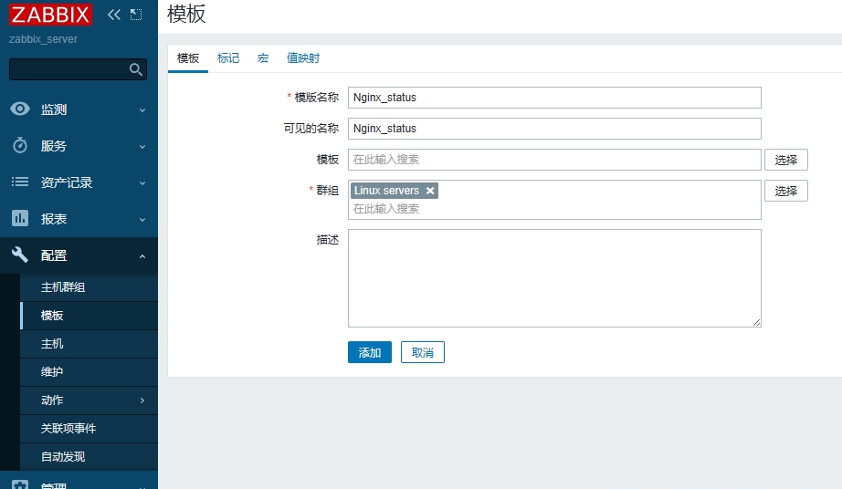
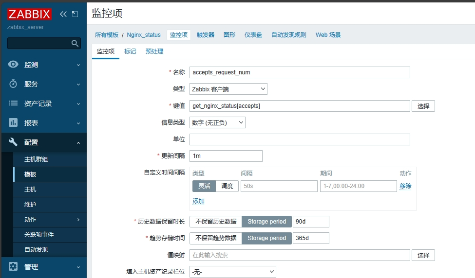
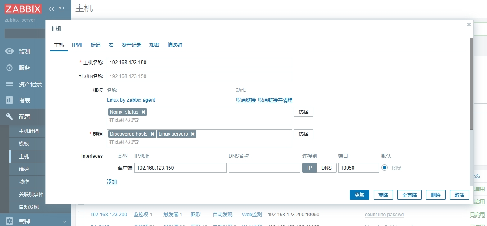
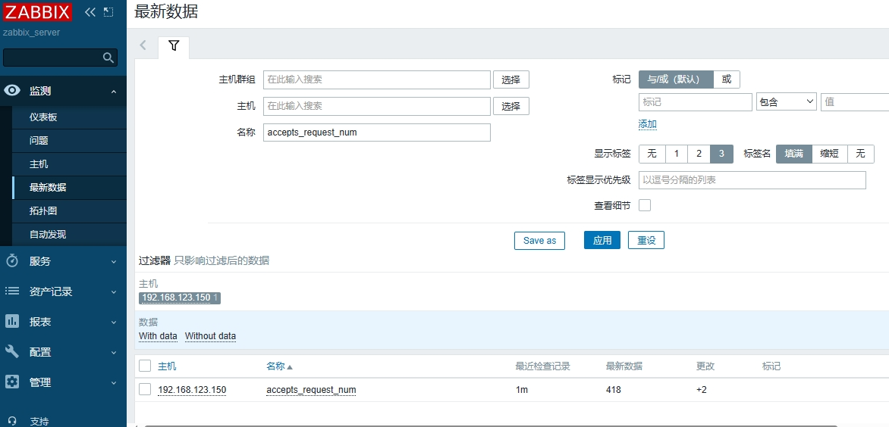

> zabbix自带监控nginx的模板，此文章仅作演示如何配置zabbix监控nginx

# 监控nginx的思路

* 配置nginx
  * 安装和配置nginx
  * 获取nginx数据
    * 编写脚本获取 /status 页面下的各个数据
* 配置zabbix客户端
  * 启用agent自定义监控项功能
  * 定义脚本为监控命令
* 配置zabbix server端
  * 在web端配置监控项
  * 设置图表显示和报警

# 配置nginx

## 检测模块

zabbix监控nginx需要nginx带有http_stub_status_module 模块，可以使用以下命令查看是否带有该模块：

```
nginx -V
```

如果没有上述模块的话，需要使用 --with-http_stub_status_module 选项重新编译nginx

## 添加配置

在nginx的配置文件中添加以下参数

```
sudo vim /etc/nginx/conf.d/zabbix.conf
#
server{  
	location /status {
        	stub_status on;
        }
}
```

配置完后，重启nginx服务

```
sudo nginx -s reload
```

测试是否配置成功

* 使用命令行 curl http://192.168.123.200:8080/status
* 使用浏览器访问 http://192.168.123.200:8080/status

返回以下参数表示配置成功

```
curl http://192.168.123.200:8080/status
#
Active connections: 9 
server accepts handled requests
 374 374 17647 
Reading: 0 Writing: 1 Waiting: 8 
```

参数简介：

* Active connections：实时连接数，当前连接nginx的数量
* server accepts handled requests：返回3个数，含义依次为：
  * 历史累计连接数量：374
  * 已处理连接的数量：374
  * 已处理请求的数量：17647。一个连接会有多个请求
* Reading：处理读请求数量，这里是0。
* Writing：处理写请求数量，这里是1。
* Waiting：等待nginx处理的请求数量，这里是8。

# 获取nginx数据

nginx数据：

```
curl http://192.168.123.200:8080/status
#
Active connections: 9 
server accepts handled requests
 374 374 17647 
Reading: 0 Writing: 1 Waiting: 8 
```

获取nginx数据的示例脚本

```
vim nginx_status.sh
#!/bin/bash
case $1 in
"active")
    curl -s http://192.168.123.200:8080/status | awk 'NR==1{ print $3}';;
"accepts")
    curl -s http://192.168.123.200:8080/status | awk 'NR==3{ print $1}';;
"handled")
    curl -s http://192.168.123.200:8080/status | awk 'NR==1{ print $3}';;
"requests")
    curl -s http://192.168.123.200:8080/status | awk 'NR==1{ print $5}';;
"reading")
    curl -s http://192.168.123.200:8080/status | awk 'NR==4{ print $4}';;
"writing")
    curl -s http://192.168.123.200:8080/status | awk 'NR==4{ print $4}';;
"waiting")
    curl -s http://192.168.123.200:8080/status | awk 'NR==4{ print $6}';;
esac
```

给脚本添加执行权限

```
chmode a+x nginx_stats.sh
```

> 提示：
>
> 未给脚本添加执行权限可以会报以下错误：
>
> command not found

# 配置agent客户端

## 启用agent自定义监控项功能

```
vim /etc/zabbix/zabbix_agentd.conf
Include=/etc/zabbix/zabbix_agentd.d/*.conf	#脚本定义路径
UnsafeUserParameters=0				#开启自定义脚本功能
```

## 定义脚本为监控命令

### 更改配置文件

```
sudo vim /etc/zabbix/zabbix_agentd.d/get_nginx_status.conf
UserParameter=get_nginx_status[*],/etc/zabbix/scripts/nginx_status.sh $1
```

更改完成后，重启agent服务

```
systemctl restart zabbix-agent
```

### 测试脚本

```
zabbix_get -s 127.0.0.1 -k get_nginx_status[active]
#返回结果
1

zabbix_get -s 127.0.0.1 -k get_nginx_status[accepts]
401
```

脚本能够正常运行。

# 配置zabbix server端

**具体步骤：**

* 常见监控模板
* 创建监控项
* 调用新创建的监控项模板
* 查看监控数据

## 创建监控模板

配置 > 模板 > 创建模板

* 模板名称：Nginx_status
* 群组：LInux servers



## 创建监控项

配置 > 选择”Nginx_status“模板 > 点击”监控项“ > 创建监控项

以创建历史累计连接数量监控项为示例：

* 名称：accepts_request_num
* 类型：Zabbix客户端
* 键值：get_nginx_status[accepts]
* 信息类型：数字（无正负）
* 其他默认

比较重要的信息是：键值：get_nginx_status[accepts]



其他监控参数创建方法一直，此处不做赘述。

## 调用新创建的监控项模板

### 为主机添加模板链接

配置 > 主机 > 点击具体主机名称 > 选择相应的”Nginx_status“模板 > 更新即可



## 查看监控数据

监测 > 最新数据 > 选择设置了nginx监控模板的主机 > 使用名称：accepts_request_num 筛选监控项

下图显示配置的Nginx监控项运行正常


