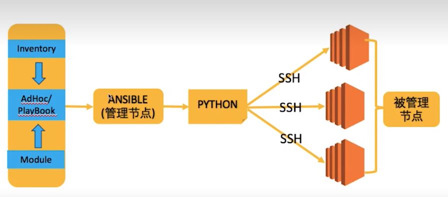

# 实验环境

系统版本：rockylinux9.2

# 简介

Ansible是一种由python编写的开源的自动化工具，用于配置管理、应用部署和任务自动化。它允许系统管理员通过定义和管理主机配置文件，轻松地自动执行复杂的任务，而无需编写大量的脚本或手动操作。Ansible采用声明性语言，用户可以使用YAML格式的Playbooks来描述任务和配置。

以下是Ansible的一些主要特点：

1. **简单性** : Ansible的Playbooks使用简单的YAML语法，易于理解和编写。无需深厚的编程技能，即可创建自动化任务。
2. **无需客户端** : Ansible不需要在远程主机上安装客户端，只需在控制节点上安装即可。这降低了配置和管理的复杂性。
3. **Agentless架构** : Ansible使用SSH协议来连接和执行任务，无需在远程主机上安装代理。这使得部署和维护变得更加简单。
4. **模块化** : Ansible提供了众多的模块，用于执行不同的任务。这些模块包括文件操作、软件包管理、服务管理等，用户可以根据需要组合这些模块构建自己的自动化任务。
5. **扩展性** : Ansible具有丰富的插件和模块系统，允许用户编写自定义插件以满足特定需求。
6. **多平台支持** : Ansible支持在各种操作系统上运行，包括Linux、Windows和Unix。

# 工作原理

## 架构图简介



## 主要组成部分

1. **控制节点(Control Node)** : 控制节点是执行Ansible命令的机器，通常是管理员的工作站或服务器。在控制节点上，Ansible命令和Playbooks被创建和执行。
2. **目标主机(Managed Nodes)** : 这是管理员希望进行配置管理或任务自动化的机器。在目标主机上，Ansible会通过SSH连接执行特定的任务，而无需在远程主机上安装任何额外的代理。
3. **Inventory(资产或清单)** : 清单是一份描述目标主机的清单文件，其中包含目标主机的IP地址或主机名，以及可以对其执行的特定组或变量。清单文件是一个文本文件，也可以是一个动态清单，通过脚本或外部系统生成。
4. **模块(Modules)** : 模块是Ansible中执行具体任务的组件。每个模块负责完成一个特定的任务，比如文件操作、软件包管理、用户管理等。Ansible模块是可重用的，并且可以组合在一起以构建更复杂的任务。
5. **Playbooks(剧本)** : Playbooks是由YAML格式编写的文本文件，用于定义一系列任务和配置。Playbooks描述了一组操作，包括目标主机、要运行的角色（roles）、变量、任务等。通过执行Playbooks，管理员可以轻松地自动化复杂的系统管理任务。
6. **角色(Roles)** : 角色是一种组织和封装Playbooks的方式，用于将相关的任务和配置分组。通过使用角色，可以更好地组织和重用Ansible的配置。
7. **任务(Tasks)** : 任务是Playbooks的基本单位，它们定义了要在目标主机上执行的具体操作。每个任务通常由一个或多个模块组成。
8. **变量(Variables)** : 变量允许管理员在Playbooks中定义可重用的值。这些值可以是常量、动态生成的值或来自清单文件中的值。使用变量可以使Playbooks更加灵活和可配置。

## 运行流程

1. **解析Inventory** : Ansible首先会解析清单文件（Inventory），其中包含了目标主机的信息，如主机名、IP地址、组等。这一步用于确定要操作的目标主机。
2. **连接到目标主机** : Ansible通过SSH协议连接到目标主机。这要求在目标主机上配置了正确的SSH密钥或用户名/密码，以确保与目标主机的安全连接。
3. **加载变量和配置** : Ansible会加载Playbooks中定义的变量以及Ansible配置文件中的配置项。这些变量可以包括用于定制任务行为的值。
4. **解析Playbooks** : Ansible会解析用户提供的Playbooks，这是YAML格式的文件，其中定义了一系列任务、角色、变量和其他配置。这一步用于确定要在目标主机上执行的操作。
5. **执行任务** : Ansible按照Playbooks中的定义，逐一执行任务。每个任务通常包含一个或多个模块，用于完成特定的操作，比如复制文件、安装软件包、配置服务等。
6. **生成事实(Facts)** : 在执行任务的过程中，Ansible会收集关于目标主机的信息，这些信息被称为事实（Facts）。这些事实可以在后续任务中使用。
7. **报告结果** : Ansible会生成执行结果的报告，包括每个任务的执行状态、错误信息等。这些报告对于了解任务的执行情况和排查问题非常有用。
8. **清理** : 在所有任务完成后，Ansible会关闭与目标主机的连接，释放资源，并在控制节点上生成详细的执行日志。

# 安装ansible

## epel源安装

```
sudo dnf install epel-release -y	#安装epel源
sudo dnf install ansible -y
#验证
ansible -v				#有结果说明安装成功
ansible [core 2.14.9]
......
```

## pip安装

```
pip install ansible
```

# 控制节点建立与目标主机连接

## 设置免密登录

**生成SSH密钥对**

```
ssh-keygen -t rsa
```

在 `~/.ssh/`目录下生成私钥文件（默认为 `id_rsa`）和公钥文件（默认为 `id_rsa.pub`）

**分发公钥到目标主机**

```
ssh-copy-id user@target_host	#将公钥添加到目标主机用户的authorized_keys文件，允许控制节点通过私钥进行身份验证
```

也可以手动复制并粘贴公钥到目标主机的 `~/.ssh/authorized_keys`文件中

# 快速入门

## 示例1：测试控制节点与目标主机网络连通性

* 控制节点
  * 192.168.123.200
* 目标节点
  * 192.168.123.130
  * 192.168.123.131

### 配置免密登录

在192.168.123.200主机上操作：

```
ssh-keygen -t rsa
ssh-copy-id fams_itoper01@192.168.123.130	#fams_itoper01是用户名
ssh-copy-id fams_itoper01@192.168.123.131
```

验证

```
ssh fams_itoper01@192.168.123.130
ssh fams_itoper01@192.168.123.131
```

能正常登录以上两台主机的话说明免密配置正常

### 测试网络连通性

在控制节点执行

```
ansible all -i 192.168.123.130,192.168.123.131 -m ping
#结果正常
192.168.123.131 | SUCCESS => {
    "ansible_facts": {
        "discovered_interpreter_python": "/usr/bin/python3"
    },
    "changed": false,
    "ping": "pong"
}
192.168.123.130 | SUCCESS => {
    "ansible_facts": {
        "discovered_interpreter_python": "/usr/bin/python3"
    },
    "changed": false,
    "ping": "pong"
}
```

命令简介：

* `all`：Ansible 主机模式的指定方式，表示命令将对所有主机执行。
* `-i`：指定 Inventory 文件。Inventory 文件用于定义 Ansible 将要管理的主机及其组。在这个命令中，直接使用了一个逗号分隔的列表，表示两个目标主机。
* **`-m ping`** : 使用的 Ansible 模块和模块参数。在这里，`-m ping` 表示使用 ping 模块。ping 模块实际上并不执行常规的 ICMP ping 操作，而是简单地测试是否可以与目标主机建立连接。

# 示例2：将 /tmp/test.conf 发布到所有目标节点

```
#创建测试文件
echo "just test file" >> /tmp/test.conf

#执行ansible
#结果显示已成功
ansible all -i 192.168.123.130,192.168.123.131 -m copy -a "src=/tmp/test.conf dest=/tmp/test.conf"
192.168.123.130 | CHANGED => {
    "ansible_facts": {
        "discovered_interpreter_python": "/usr/bin/python3"
    },
    "changed": true,
    "checksum": "a2132f3f42d345a21a497ea4e9c38f894265a7c3",
    "dest": "/tmp/test.conf",
    "gid": 1000,
    "group": "fams_itoper01",
    "md5sum": "3f1b5460018e776424c7e2ec9f1fbe4d",
    "mode": "0644",
    "owner": "fams_itoper01",
    "size": 15,
    "src": "/home/fams_itoper01/.ansible/tmp/ansible-tmp-1705911687.6517296-50530-46790991355510/source",
    "state": "file",
    "uid": 1000
}
......


#在192.168.123.130上确实存在该文件，说明ansible执行成功
ll /tmp/test.conf
-rw-r--r-- 1 fams_itoper01 fams_itoper01 15 Jan 22 16:21 /tmp/test.conf
```

命令简介：

* **`-m copy`** : 表示使用 `copy` 模块，该模块用于在远程主机上复制文件。
* **`-a "src=/tmp/test.conf dest=/tmp/test.conf"`** :
  * `-a` 表示传递模块的参数，参数是一个键值对列表，包含 `src` 和 `dest`。
  * 具体含义是将本地文件 `/tmp/test.conf` 复制到目标主机的 `/tmp/test.conf`。

# 资产（Inventory）

## 定义

资产通常指的是被 Ansible 管理的主机、设备或节点。这些资产信息被组织在清单（Inventory）中。资产可以分为静态资产和动态资产。

## 静态资产

静态资产是在清单文件中静态定义的，手动编写并存储在文件中的主机信息。这些主机信息包括主机名、IP地址、连接信息等，以及可选的主机变量。

### **特点：**

* **手动管理：** 由管理员手动编辑清单文件，添加、修改、删除主机信息。
* **简单：** 适用于相对稳定、数量较少的环境，主机信息不频繁变化。
* **INI 或 YAML 格式：** 静态清单文件可以采用 INI 格式或 YAML 格式。

### 格式：

示例（INI 格式）：

```
[web_servers]
10.25.1.57						#单台主机
web1 ansible_host=192.168.1.101 ansible_user=ubuntu	#web01是主机别名

[db_servers]
db1 ansible_host=192.168.1.201 ansible_user=admin

[all_servers]
[all_servers:children]					#子组，:children 是固定写法
db1 ansible_host=192.168.1.201 ansible_user=admin
www[001:006].example.com				#代表001到006的6台主机
```

格式简介：

* `[all_servers]`：组名
* `[all_servers:children]`： 子组，组名:children  是固定写法，代表一个子组。
* `www[001:006].example.com`：代表多个资产
  * 格式：[start:end]
* **`web1`** : 这是主机的别名，也是在 Ansible 中用于标识和引用这台主机的名称。这个名字可以在 Ansible 的 Playbooks 或 Ad-Hoc 命令中使用。
* **`ansible_host=192.168.1.101`** : 这是指定主机的 IP 地址。`ansible_host` 是 Ansible 中用于指定主机 IP 地址的关键字。
* **`ansible_user=ubuntu`** : 这是指定连接到主机时所使用的用户名。`ansible_user` 是 Ansible 中用于指定连接用户的关键字。

> 提示：
>
> `ansible_host` 和 `ansible_user` 是 Ansible 中特定的预定义变量名，用于指定主机的 IP 地址和连接用户名。这些变量名是 Ansible 约定的，具有特殊的含义，因此在清单文件中使用这些名称来定义主机信息是一种推荐的做法。

示例（YAML 格式）：

```
all:
  hosts:
    web1:
      ansible_host: 192.168.1.101
      ansible_user: ubuntu
    web2:
      ansible_host: 192.168.1.102
      ansible_user: centos
  children:
    db_servers:
      hosts:
        db1:
          ansible_host: 192.168.1.201
          ansible_user: admin
```

## 动态资产

动态资产是在运行时由外部脚本或程序生成的主机信息。这种方式允许 Ansible 自动发现和管理主机，适用于动态云环境、容器化环境等场景。

### **特点：**

* **自动发现：** 主机信息在运行时动态生成，而非静态写入文件。
* **灵活性：** 适用于动态、弹性的环境，主机数量可能动态变化。
* **脚本或程序：** 外部脚本或程序负责生成主机信息。

示例：

Ansible 动态清单脚本通常以 JSON 格式输出主机信息。

```
{
  "web_servers": [
    {"ansible_host": "192.168.1.101", "ansible_user": "ubuntu"},
    {"ansible_host": "192.168.1.102", "ansible_user": "centos"}
  ],
  "db_servers": [
    {"ansible_host": "192.168.1.201", "ansible_user": "admin"}
  ]
}
```

示例（使用动态清单）：

```
ansible all -i dynamic_inventory_script.py -m ping
```

`dynamic_inventory_script.py` 是一个动态清单脚本。

## 自定义资产

使用自定义资产需要用 `-i `选项

### 列出资产中的主机

**列出所有资产**

* `ansible all -i ./inventory.ini --list-hos`
  * all代表资产文件中的所有组

**列出指定资产**

* `ansible web_name -i ./inventory.ini --list-hosts`
  * web_name是指定组的组名

#### 示例：列出自定义资产所有主机

创建自定义资产文件

```
cat << EOF > inventory.ini 
[web]
192.168.123.1
192.168.123.20
[test]
192.168.123.200
192.168.123.210
EOF
```

运行ansbile命令

```
#列出所有组主机
ansible all -i ./inventory.ini --list-hosts	#all代表资产文件中的所有组
#结果：
  hosts (4):
    192.168.123.1
    192.168.123.20
    192.168.123.200
    192.168.123.210

#列出指定组
ansible web -i ./inventory.ini --list-hosts	#web是指定组的组名
  hosts (2):
    192.168.123.1
    192.168.123.20
```

### 资产选择器

资产选择器（Inventory Selectors）是一种机制，用于从主机清单（Inventory）中选择特定的主机组或主机。

#### 格式：

```
ansible PATTERN -i inventory -m module a argument
```

常见的资产选择器示例

```
ansible all -i inventory.ini -m ping				#选择所有主机
ansible 192.168.123.1,192.168.123.2 -i inventory.ini -m ping	#选择多台主机
ansible web_servers -i inventory.ini -m ping			#选择特定主机组
ansible web_servers[0] -i inventory.ini -m ping			#选择主机组中的特定主机，0是索引，索引从0开始

ansible 'web*' -i inventory.ini -m ping			#使用模式匹配选择主机
ansible web_servers:db_servers -i inventory.ini -m ping	#使用组合选择器选择多个主机组

ansible 'web_servers:&db_servers' -i inventory.ini -m ping #选择两个组的交集的主机

ansible all:!excluded_host -i inventory.ini -m ping	#选择除了某个主机的所有主机
```

# Ad-Hoc

Ansible提供两种方式去完成任务：

* ad-hoc命令
* ansible playbook

Ansible Ad-Hoc 是一种使用 Ansible 提供的命令行工具执行即时任务的方法。Ad-Hoc 是指 "即兴的" 或 "临时的"，这种方式允许你在不编写 Playbooks 的情况下，直接在命令行中执行简单的任务。


## 格式

```
ansible [pattern] -i inventory [options] -m module -a "arguments"
```

* `pattern`：用于指定目标主机或主机组的模式，可以是主机名、主机组名、通配符等。
* `-i inventory`：指定 Ansible 清单文件的路径。
* `-m module`：要执行的 Ansible 模块，表示执行什么样的任务。
* `-a arguments`：传递给模块的参数，用于配置任务的行为。

### 示例

#### **Ping 所有主机**

```
ansible all -i inventory.ini -m ping
```

#### **复制文件到目标主机**

```
ansible web_servers -i inventory.ini -m copy -a "src=/local/path/file.txt dest=/remote/path/"
```

#### **执行 Shell 命令**

```
ansible db_servers -i inventory.ini -m shell -a "uptime"
```

## 模块

### 模块类型

* 核心模块（core modules）
  * 由Ansible官方团队提供
* 附加模块（extra module）
  * 由各个社区提供，如opentack社区，docker社区
* 自定义模块（consume module）
  * 用户自己编写

核心模块和附加模块默认安装，总计大概1000+

```
ansible-doc -l			#列出所有核心和附加模块

ansible-doc modulename		#列出某个模块用法，类似man命令
ansible-doc -s modulename	#列出某模块简要信息
```

### 常见模块

简要列举一些常见模块

#### 1. **核心模块（Core Modules）:**

这是 Ansible 的基本模块，提供了许多基础操作，包括文件操作、软件包管理、服务管理等。

* `command`：在目标主机上执行命令。
* `copy`：复制文件或目录到目标主机。
* `file`：管理文件和目录的属性。
* `apt`、`yum`：在基于 Debian 或基于 Red Hat 的系统上管理软件包。
* `service`：管理系统服务的状态。

#### 2. **系统模块（System Modules）:**

这些模块用于执行与操作系统相关的任务，如用户管理、组管理等。

* `user`：管理系统用户。
* `group`：管理系统组。
* `shell`：在目标主机上执行 shell 命令。
* `cron`：管理定时任务。

#### 3. **云模块（Cloud Modules）:**

这些模块用于与云服务提供商进行交互，管理云资源。

* `ec2`：在 AWS 上管理 EC2 实例。
* `gcp`：在 Google Cloud Platform 上管理资源。
* `azure_rm`：在 Azure 上管理资源。

#### 4. **网络模块（Networking Modules）:**

用于配置和管理网络设备。

* `ios_command`：在 Cisco IOS 设备上执行命令。
* `nxos_command`：在 Cisco Nexus 设备上执行命令。
* `junos_command`：在 Juniper Junos 设备上执行命令。

#### 5. **数据库模块（Database Modules）:**

用于与数据库交互。

* `mysql_db`：管理 MySQL 数据库。
* `postgresql_db`：管理 PostgreSQL 数据库。

#### 6. **文件模块（File Modules）:**

用于文件操作的模块。

* `find`：在文件系统中查找文件。
* `assemble`：将分散的文件组装成一个文件。

#### 7. **通信模块（Messaging Modules）:**

用于与消息队列、通知系统进行交互。

* `rabbitmq_user`：在 RabbitMQ 中管理用户。
* `slack`：向 Slack 发送消息。

#### 8. **Windows 模块（Windows Modules）:**

用于在 Windows 主机上执行任务。

* `win_service`：管理 Windows 服务。
* `win_user`：管理 Windows 用户。

#### 9. **其他模块（Other Modules）:**

其他类型的模块，用于执行特定的任务。

* `assert`：用于断言条件是否为真。
* `wait_for`：等待条件成立。
