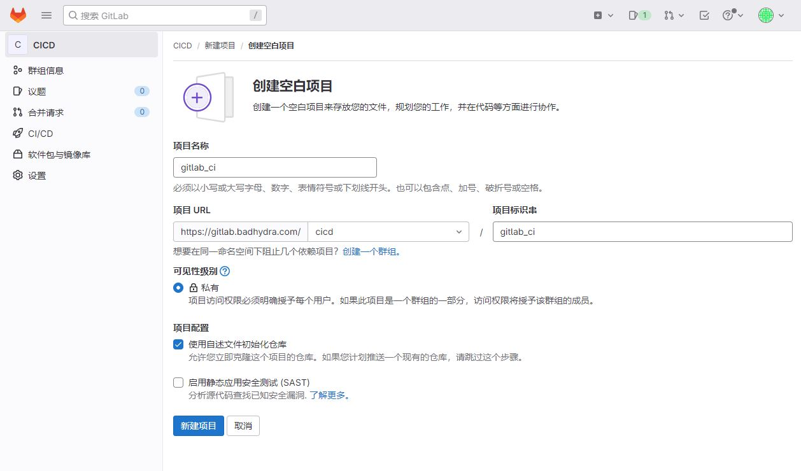

# CI/CD模板

## 简介

* CI/CD模板允许你在项目中轻松共享和重用CI/CD配置。通过使用模板，你可以减少配置文件的重复，并确保在项目之间保持一致性。
* 模板文件以 `.gitlab-ci.yml` 为扩展名，通常存储在项目的特定目录中，如 `/.gitlab` 或 `/templates`。

简单的示例：

```
# .gitlab-ci.yml

include:
  - template: Jobs/Build.gitlab-ci.yml
  - template: Jobs/Test.gitlab-ci.yml
  - template: Jobs/Deploy.gitlab-ci.yml
```

```
#Build.gitlab-ci.yml
.build:				#模板阶段以 . 开头
  stage: build
  tags:
    - build
  script: 
    - $BUILD_SHELL
    - ls
```

在这个示例中：

* `include` 关键字用于包含其他文件，这些文件通常是CI/CD模板。
* `Jobs/Build.gitlab-ci.yml`、`Jobs/Test.gitlab-ci.yml` 和 `Jobs/Deploy.gitlab-ci.yml` 是具体的CI/CD模板文件。

## 模板分类

**内置模板：**

* GitLab 提供了一些内置的 CI/CD 模板，可以直接使用。这些模板涵盖了常见的 CI/CD 需求，如构建、测试、部署等。

**自定义模板：**

* 除了使用内置模板外，你还可以创建自定义的 CI/CD 模板以满足特定项目的需求。自定义模板通常包含一组作业定义、阶段定义或全局配置。

**参数化模板：**

* 模板支持参数化，允许你将变量传递到模板中。这样可以使模板更加灵活，适应不同的场景。

```
include:
  - template: Jobs/Build.gitlab-ci.yml
    parameters:
      MY_VARIABLE: "some_value"
```

**局部模板：**

* 项目还可以定义局部模板，这些模板仅在项目内可见，不会影响其他项目。局部模板存储在项目的 `.gitlab-ci` 目录中。

**共享模板：**

* GitLab 提供了一种将 CI/CD 模板存储在特定的模板项目中的方式，这样就可以在多个项目中共享相同的模板。

```
include:
  - project: 'group/my-templates'
    file: '/path/to/my-template.yml'
```

## 示例：

### 模板库规划

创建一个Group用来保存作业和模板，其他项目使用模板时，直接调用该库的模板就行。


创建一个仓库，名为：gitlab_ci，用来保存gitlab ci的操作文件



建两个文件夹用来保存作业和模板

* jobs：保存作业
* templates：保存模板


# 构建工具集成

## 后端项目Maven集成

先在jobs目录中创建一个build.yml，然后在里面编写build作业模板。

```
.build:
  stage: build
  tags:
    - build
  script: 
    - $BUILD_SHELL
    - ls
```

然后我们在template目录中创建maven流水线模板。 templates/java-pipeline.yml

```
include:
  - project: 'CICD/gitlab_ci'
    ref: master
    file: 'jobs/build.yml'

variables:
  BUILD_SHELL: 'mvn clean package  -DskipTests'              ##构建命令
  CACHE_DIR: 'target/'
  
cache:
  paths:
    - ${CACHE_DIR}
    
stages:
  - build

build:
  stage: build
  extends: .build

```


## 前端项目Npm集成


# Reference Links：

http://docs.idevops.site/gitlabci/chapter04/01/1/
